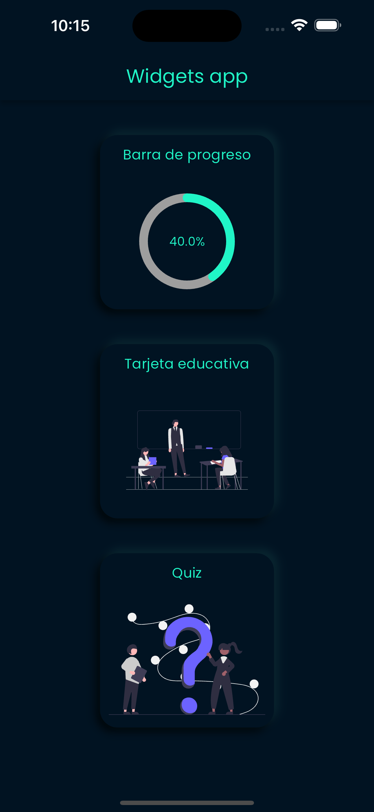
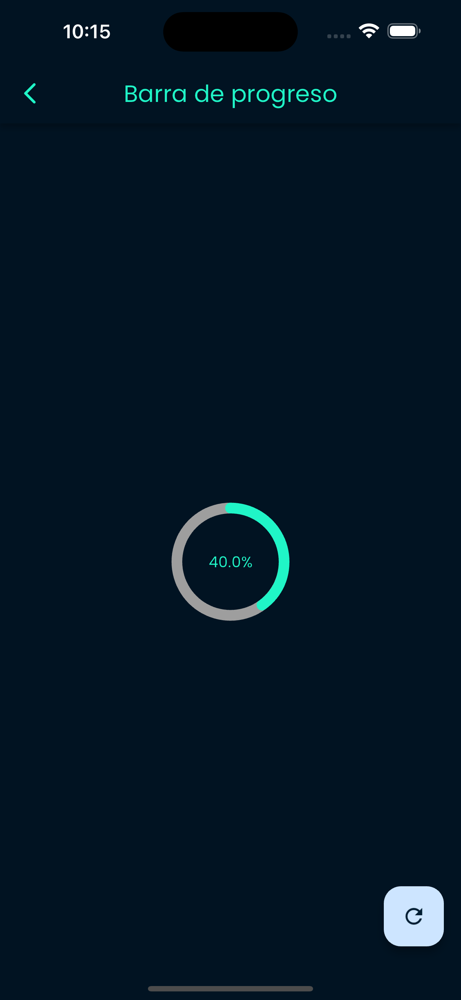
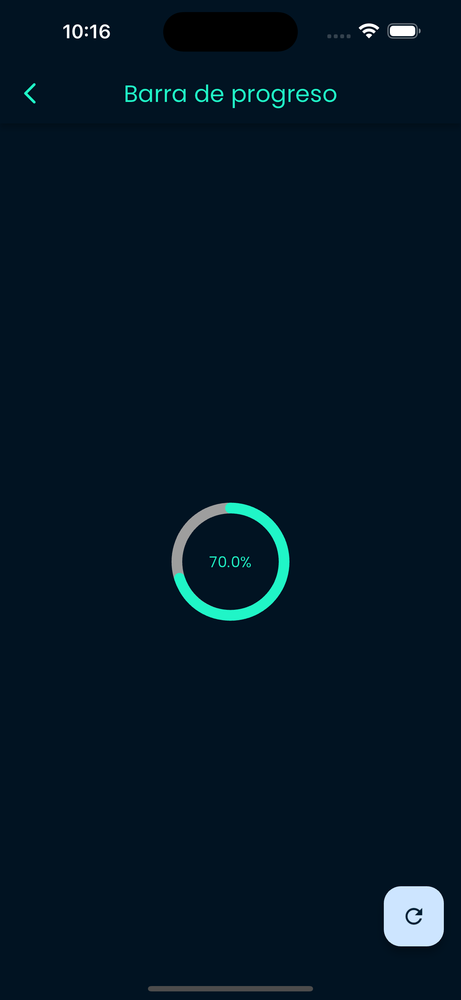
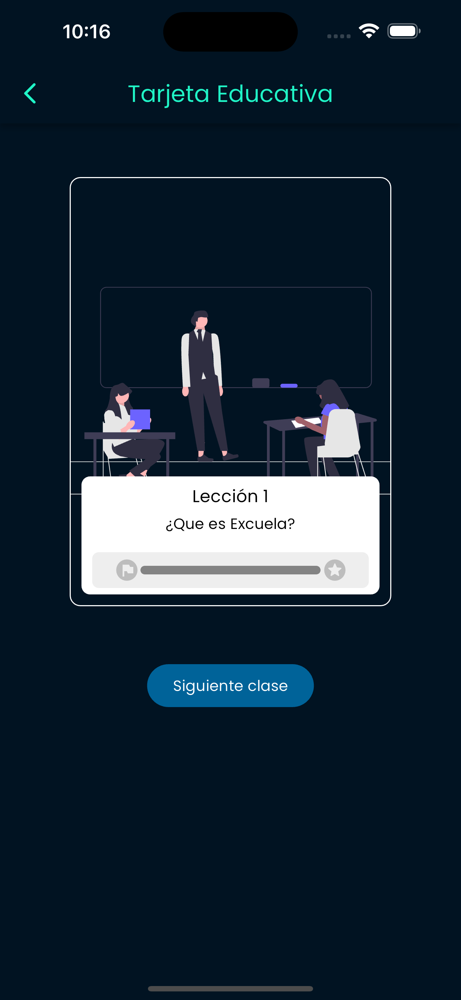
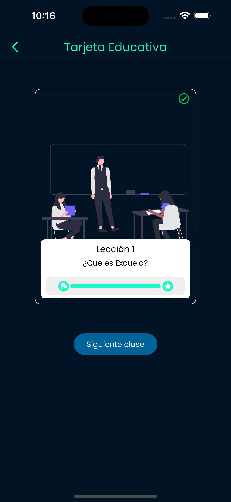
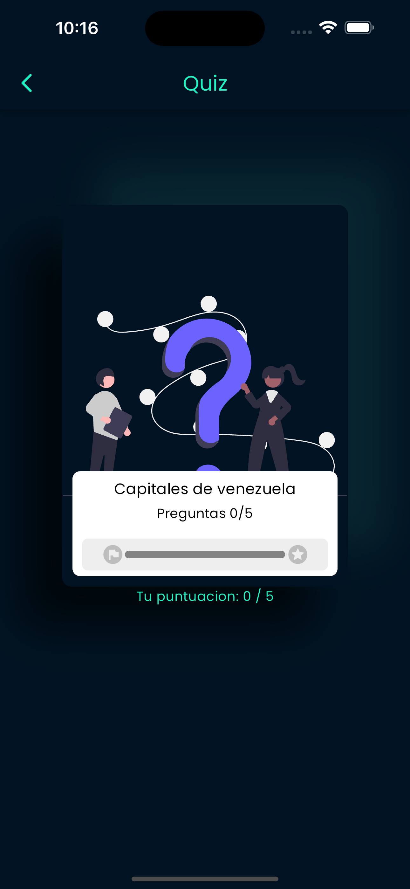
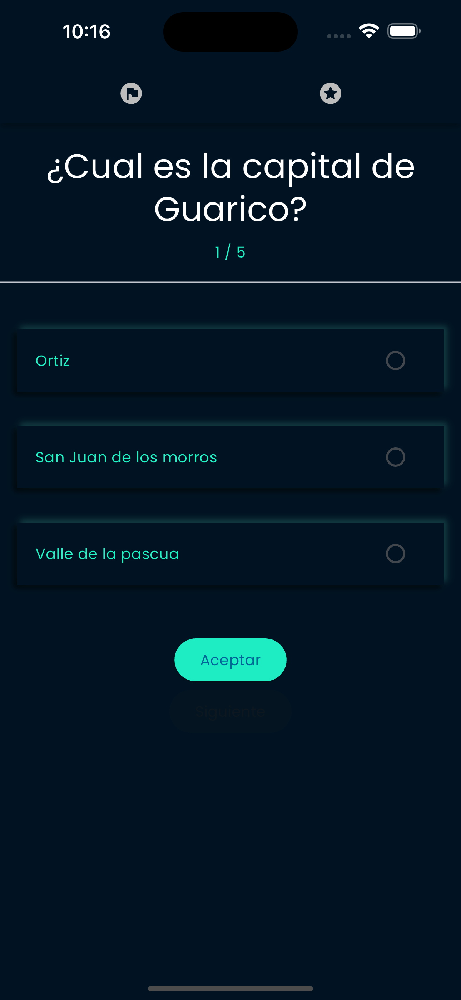
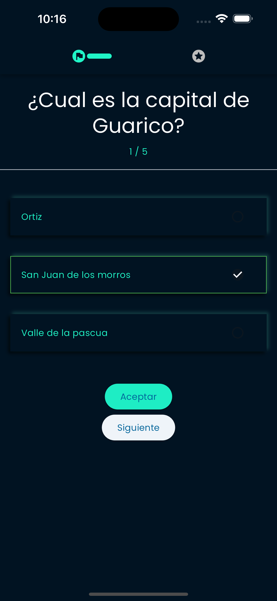
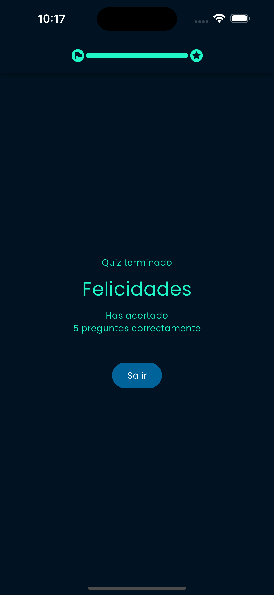
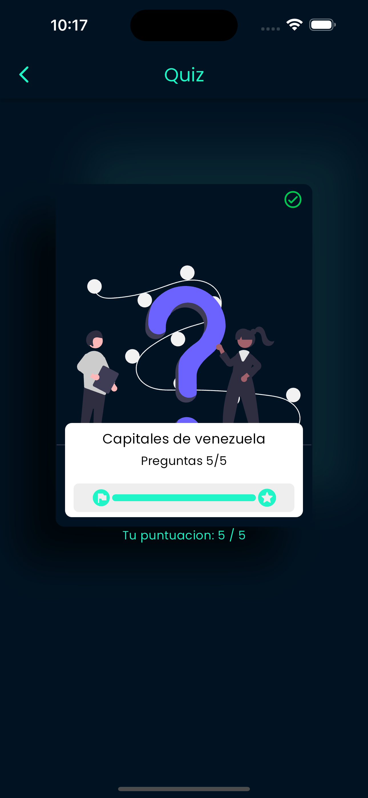

# Widgets app

Proyecto de widgets personalizados a la educacion en linea.

## Getting Started

```
flutter pub get
```

### Para acceder a los widgets personalizados
    lib/shared/widgets/













